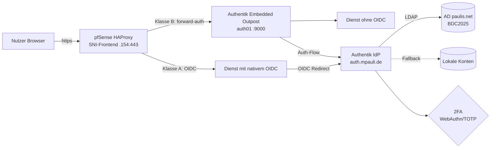
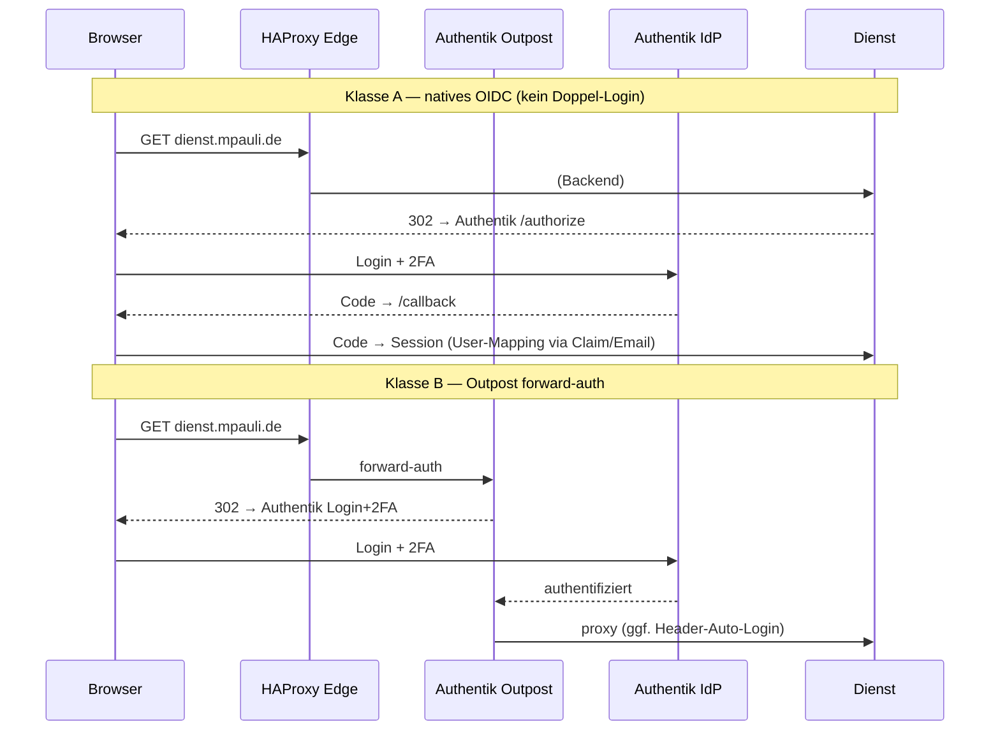
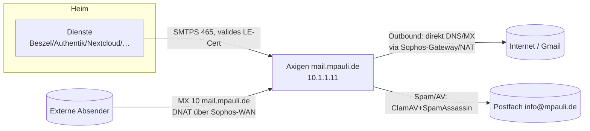

# Schwalbe SSO — Authentik-Zentralisierung

**Ist-Stand: 2026-07-15** · IdP: Authentik `2026.5.3` (`auth.mpauli.de`) · Edge: pfSense-HAProxy (`…154:443`, SNI-Frontend) · Identität: AD `paulis.net` (primär) + lokal (Fallback), 2FA (WebAuthn/TOTP) erzwungen.

> ⚠️ Dieses Dokument enthält **keine** Passwörter/Secrets/Tokens. Interne IPs/Namen sind bewusst enthalten (privates Repo).

---

## 1. Architektur

**Zwei SSO-Klassen:**

---

## 2. Klassifizierungs-Schema

| Klasse | Bedeutung |
|---|---|
| **A — OIDC-nativ** | App kann OIDC selbst → echtes SSO, kein Doppel-Login. Bevorzugt. |
| **B — Outpost-gated** | Kein OIDC → Authentik-Proxy-Outpost davor (302→Login+2FA), dann Dienst-Login/Header-Auto-Login. |
| **C — Guacamole** | Nicht-Web (RDP/SSH/VNC/Konsole) über `guac.mpauli.de`. |
| **D — Gast-Dashboard** | Read-only, auth-frei, an Authentik vorbei (`guest.mpauli.de`) — nur aus dem LAN; aus dem Internet via Authentik. |
| **X — nicht gate-bar** | API/Sync/Maschinen-Clients — NICHT hinter Outpost (bricht Client). Nur App-OIDC oder Netz-ACL/Token. |

---

## 3. Dienst-Inventar (Ist-Stand)

### ✅ In SSO (fertig)
| Dienst | Host | Klasse | Mechanismus / Notiz |
|---|---|---|---|
| Authentik | auth01 :9000 | — | IdP |
| Guacamole | auth01 :8080 | A | OIDC nativ; Konsolen-Zugänge (Klasse C) |
| ITSO-KI (Open-WebUI) | ki02 :8080 | A | OIDC nativ |
| Home Assistant | NUC-HA :8123 | B | Outpost + Header-Auto-Login (`auth_header`, `X-authentik-username`→HA-User „Marcus"); Provider-Session 7 T |
| Immich | Synology :2283 | A | OIDC nativ (Mobile-App OAuth) |
| Grafana (monitoring) | K3s :80 | A (+D) | `generic_oauth`; Gast-Dashboards (LAN-frei / extern via Authentik) |
| anythingllm | ki02 | A→bridge | SIMPLE_SSO + Bridge (`X-authentik-username`→issue-auth-token) |
| MISP | Synology :7443 | A | OIDC nativ (`misp-nas`, Gruppen-Claim→Rolle) |
| karakeep | Synology :3000 | A | OIDC (NextAuth, custom provider) |
| Beszel | NUC-HA :8090 | A | PocketBase-OIDC (`oidc`/Authentik), `_externalAuths`-Link vorab; direkt (kein Outpost-Gate wg. Popup/Realtime) |
| **Mayan EDMS** | mayan01 :80 | A | **Native OIDC (mozilla-django-oidc)**; Email-Matching → `mpauli`(Admin) / `jella`(scoped); App auf mpauli+jella beschränkt |
| **Monitor (Uptime Kuma)** | 10.1.1.222:3001 | B | Outpost-Gate, `disableAuth=true` (nahtlos); App auf mpauli beschränkt |
| Jella-KI | ki02 :3001 | B | Outpost-Gate |
| bewerbungsassistent, spiderfoot, maigret, blackbird, backup-dashboard, dhgrafana, rsshub, searxng u.a. | div. | B | Outpost-gated (21 Proxy-Provider) |

### 🕓 Offen / geplant
| Dienst | Host | Klasse | To-do |
|---|---|---|---|
| Portainer | NUC-HA :9443 | A | OIDC (CE OAuth) |
| Proxmox prox2 | :8006 | B+C | GUI via Outpost; Node-Shell via Guacamole. LE-Cert `pve2.mpauli.de` bereits gesetzt |
| Nextcloud | Synology | A | OIDC-App (Zert-Härtung bereits erledigt) |
| ArgoCD, Superset, XWiki, Paperless-ngx, CheckMK, DSM | K3s/div. | A | App-OIDC |
| Node-RED, n8n, NSDAP-UI, Paperless-AI | div. | B | Outpost-gated |
| splunk67, conf67 | down | A | Backend erst hochfahren (bewusst zurückgestellt) |

### KEEP / Sonderfälle (bewusst offen)
| Dienst | Entscheidung | Grund |
|---|---|---|
| pfSense-GUI | LAN-direkt, nicht gaten | Authentik läuft HINTER pfSense (zirkulär) |
| Joplin (joplin67) | offen | Sync-Clients können kein interaktives OIDC (X) |
| Pingvin (pingvin67) | offen | anonymer Gäste-Upload gewollt |
| Barbeleg (invoice) | eigenes GeoIP-DE + Basic-Auth | THW-Nutzer nicht im Verzeichnis |
| MQTT, Ollama, Registry, Trino/Hive/MinIO | Netz-ACL/Token | Maschinen-/Daten-Plane (X) |

---

## 4. Startseite

`start.mpauli.de` (intern-only) = statische Übersicht aller SSO-Dienste (nginx auf LXC200 :8090), als Browser-Startseite + Homarr-Kachel.

---

## 5. Mail-Infrastruktur (Axigen)

Beim SSO-Rollout mit-erneuert: Alle Dienste versenden Mail über **Axigen** (`mail.mpauli.de`, VM106/Hetzner `10.1.1.11`).

- **Cert:** gültiges LE `mail.mpauli.de` auf Axigen (statt self-signed). Interner Split-Horizon → `10.1.1.11` (IPsec-Pfad).
- **Outbound:** Axigen liefert **direkt** per DNS/MX (SPF-autorisiert), da der Sophos-MTA-Relay defekt war (22k-Queue). Verkehr läuft trotzdem durch die Sophos-Firewall (Gateway/NAT).
- **Inbound:** MX nur noch `mail.mpauli.de` → DNAT über Sophos-WAN → Axigen (Sophos-MTA umgangen, Axigen scannt selbst). Toter `fw2`-MX entfernt.
- **SMTP-Rollout:** Beszel, Authentik, Nextcloud, karakeep, MISP, Grafana → alle `mail.mpauli.de:465`.

---

## 6. Bausteine & Konventionen

- **Edge:** pfSense-HAProxy, ein SNI-Frontend. Pro Dienst: Backend + ACL. ⚠ `/tmp/haproxy_server_state` pinnt alte addr/port → bei Backend-Änderung Hard-Restart.
- **DNS:** Split-Horizon `*.mpauli.de` intern → `.154` (unbound custom_options + AdGuard-Rewrite). `sso-dns-sync` (cron) spiegelt Home-IP-Records + `sso-internal-hosts.txt` (intern-only-Dienste). Nicht-.154-Ziele (pve2, mail) via unbound `custom_options`.
- **Zerts:** acme.sh, DNS-01 (`dns_mphcloud`, Hetzner Cloud DNS), ec-256, LetsEncrypt.
- **Helfer (NUC-HA):** `sso-gate.sh <name> <fqdn> <url> [--internal-only]` (ProxyProvider-Gate), `sso-publish.sh <name> <fqdn> <ip> <port>` (Edge-Publish), `sso-oidc-provider.sh`, `sso-dns-sync.sh`.
- **Identität:** AD `paulis.net` (LDAP-Source) primär, lokal Fallback. Neue lokale Konten nur wo nötig (z.B. `jella`).
- **Sensible Dienste** (MISP, PBS, phpIPAM, Nextcloud, Mayan) = **intern-only** (kein öffentlicher A-Record, extern NXDOMAIN).

---

## 7. Lessons Learned (Auszug)

- **Beszel/PocketBase:** OIDC-Popup/Realtime bricht hinter forward-auth-Gate → direkt routen; `_externalAuths`-Link vorab anlegen (sonst 403 „Only superusers"); SSE `/api/realtime` braucht `proxy_buffering off`.
- **Mayan:** natives OIDC via config.yml (`AUTHENTICATION_BACKEND`+`_ARGUMENTS`), Default-`SIGN_ALGO=HS256` → **RS256** für Authentik; User-Matching per **Email**.
- **Home Assistant:** `auth_header` braucht exakten Header-Namen (`X-authentik-username`), sonst eigener Login.
- **ProxyProvider ist Subklasse von OAuth2Provider** → beim Typ-Check zuerst auf ProxyProvider prüfen.
- **Mail:** Sophos-MTA war die eigentliche Fehlerquelle (Queue/Relay-ACL) → Direkt-Zustellung + DNAT-Inbound umgeht ihn.
